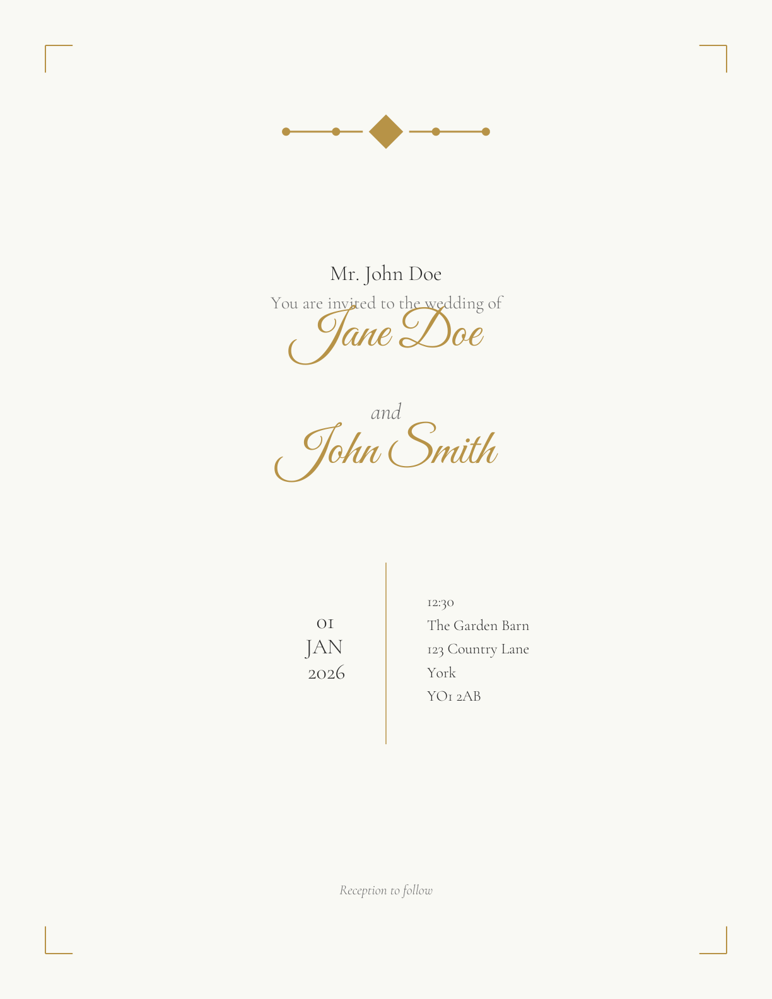

# Wedding Invitation PDF Generator

Create beautiful, personalized wedding invitation PDFs — no design software required. Edit a simple settings file, run one command (or double-click a script), and your invitations are ready to print or email.



## For non-technical users (quick start)

1. **Get the project** — download or clone this folder to your computer.
2. **First-time setup**
   - **Mac / Linux:** double-click `scripts/setup.sh`, or open Terminal in this folder and run:
     ```bash
     ./scripts/setup.sh
     ```
   - **Windows:** double-click `scripts/setup.bat`
3. **Add your details** — open `config.yaml` in any text editor (Notepad, TextEdit, VS Code). Fill in names, date, venue, and guests. See `config.example.yaml` for commented guidance.
4. **Create invitations**
   - **Mac / Linux:** run `./scripts/generate.sh`
   - **Windows:** double-click `scripts/generate.bat`
   - Or run: `python generate.py --open` (the `--open` flag opens the output folder when done)
5. **Find your PDFs** in the `generated_invitations` folder.

**Preview first:** run `python generate.py --preview` to create a single test invitation before printing the full guest list.

**Guest list from Excel:** save a spreadsheet as CSV (see `guests.example.csv`), then add to `config.yaml`:

```yaml
guests_file: "./guests.csv"
```

## Features

- **Easy configuration** — plain YAML with helpful error messages if something is missing
- **Flexible dates** — `15 June 2026`, `2026-06-15`, and `15/06/2026` all work
- **Elegant typography** — bundled script and serif fonts (with automatic fallback)
- **Clean layout** — long names and addresses wrap gracefully
- **Safe filenames** — e.g. `mr-john-doe-wedding-invitation.pdf`
- **Customizable design** — colors, wording, and page size in `design.yaml`
- **Batch generation** — one PDF per guest

## Installation (developers)

Requires **Python 3.9+**.

```bash
pip install -r requirements.txt
cp config.example.yaml config.yaml   # if you don't have config.yaml yet
python generate.py
```

## Command-line options

| Option | Description |
|--------|-------------|
| `python generate.py` | Generate all invitations |
| `python generate.py --preview` | Generate only the first guest (for proofing) |
| `python generate.py --open` | Open the output folder when finished |
| `python generate.py -c other.yaml` | Use a different config file |
| `python generate.py -d design.yaml` | Use a custom design file |

## Configuration

### Wedding details (`config.yaml`)

| Field | Description |
|-------|-------------|
| `wedding.bride_name` | Bride's name (script style on the card) |
| `wedding.groom_name` | Groom's name |
| `wedding.date` | Wedding date (many formats accepted) |
| `wedding.time` | Ceremony time |
| `wedding.venue.name` | Venue name |
| `wedding.venue.address_1` | Street address |
| `wedding.venue.address_2` | City or town |
| `wedding.venue.postcode` | Postcode or ZIP |
| `wedding.reception_note` | Footer line (e.g. "Reception to follow") |
| `output.directory` | Where PDFs are saved |
| `guests` | List of `{ guest_names: "..." }` entries |
| `guests_file` | Optional CSV instead of inline `guests` |

### Design (`design.yaml`)

Adjust colors (RGB 0–1), font sizes, invitation wording, and page size (`letter`, `a4`, or `a5`).

### Editor assistance

Open `config.yaml` in VS Code or Cursor with the YAML extension — `config.schema.json` provides autocomplete and validation hints.

## File structure

```
├── config.yaml              # Your wedding details (edit this)
├── config.example.yaml      # Annotated template
├── config.schema.json       # Schema for editor hints
├── design.yaml              # Colors, fonts, wording
├── generate.py              # Main entry point
├── wedding_invites/         # Generator package
├── fonts/                   # Bundled OFL fonts
├── guests.example.csv       # Sample spreadsheet guest list
├── scripts/
│   ├── setup.sh / setup.bat
│   └── generate.sh / generate.bat
├── screenshots/
│   └── example_invitation.png
└── generated_invitations/   # Output PDFs (created automatically)
```

## Troubleshooting

| Problem | What to do |
|---------|------------|
| `config.yaml` not found | Copy `config.example.yaml` to `config.yaml` |
| Date not understood | Use a clear format like `15 June 2026` |
| No guests listed | Add guests under `guests:` or set `guests_file` |
| Fonts look plain | Ensure `fonts/*.ttf` files are present (see `fonts/README.md`) |
| Python not found | Install Python 3.9+ from [python.org](https://www.python.org/downloads/) |

## Design

Invitations use a cream background, gold accents, corner flourishes, and centered typography. Couple names use an elegant script face; details use a refined serif. The look is intentionally minimal and print-friendly.

## License

This project is licensed under the GNU General Public License v3.0 — see [LICENSE.md](LICENSE.md).

Bundled fonts are under the [Open Font License](https://openfontlicense.org/) — see [fonts/README.md](fonts/README.md).

## Contributing

Issues and pull requests are welcome.
